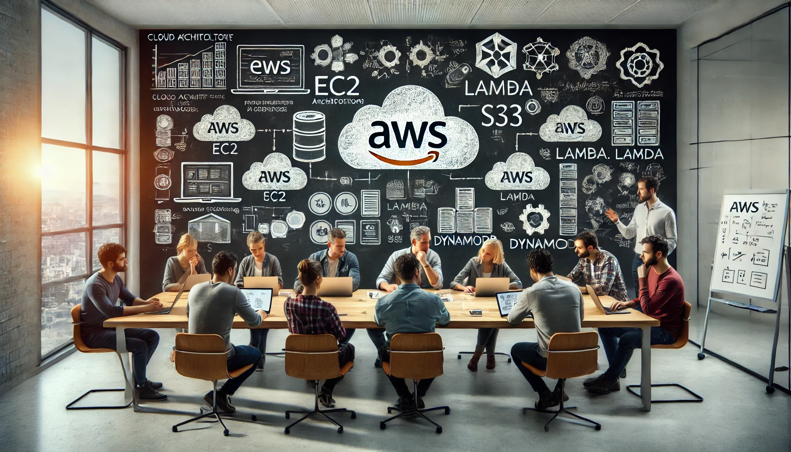

# aws-study

個人の AWS 勉強や、社内勉強会で使用した資料を公開しているリポジトリです。

AWS ドキュメントなどを参照し作成しておりますが、記載の誤り等が含まれる場合がございます。

最新の情報については、AWS 公式ドキュメントをご参照ください。

claat を使った Codelabs 形式ドキュメントは ⇒[GitHub Pages](https://ishiharatma.github.io/aws-study/)で公開しています。

## 目次: サービス

[AWS 勉強ガイド](/articles_base/aws-study-guide.md)

[AWS 学習教材完全ガイド 2023 年最新版](/articles_base/aws-study-guide-2023.md)

[AWS アカウント作成後に行うべき設定事項](/articles_base/aws-account-Initial-setting.md)

### コンピューティング

[ELB 概要](/articles_base/elb-overview.md)

[AWS Lambda 概要](/articles_base/lambda-overview.md)

AWS Elastic Beanstalk

Amazon Lightsail

AWS Batch

### データベース

[RDS と Aurora の比較](/articles_base/rds-aurora-overview.md)

[Amazon RDS 概要](/articles_base/rds-overview.md)

[Amazon Aurora 概要](/articles_base/aurora-overview.md)

[Amazon DynamoDB 概要](/articles_base/dynamodb-overview.md)

[Amazon ElastiCache 概要](/articles_base/elasticache-overview.md)

Amazon Redshift

### ネットワーキング

[Amazon Route 53 概要](/articles_base/route53-overview.md)

[Amazon API Gateway 概要](/articles_base/apigw-overview.md)

[Amazon CloudFront 概要](/articles_base/cloudfront-overview.md)

[AWS Direct Connect 概要](/articles_base/directconnect-overview.md)

[AWS Transit Gateway 概要](/articles_base/transitgw-overview.md)

AWS VPN

AWS Global Accelerator

AWS PrivateLink

### ストレージ

[Amazon S3 概要](/articles_base/s3-overview.md)

[Amazon EBS 概要](/articles_base/ebs-overview.md)

Amazon EFS

Amazon FSx

AWS Storage Gateway

AWS Backup

### セキュリティ、アイデンティティ、コンプライアンス

[AWS IAM 概要](/articles_base/iam-overview.md)

[AWS IAM マルチアカウント管理](/articles_base/iam-multi-account.md)

[AWS IAM Identity Center 概要](/articles_base/iam-identity-center-overview.md)

[AWS KMS 概要](/articles_base/kms-overview.md)

[AWS Certificate Manager 概要](/articles_base/acm-overview.md)

[AWS WAF & Shield 概要](/articles_base/waf-and-shield-overview.md)

[Amazon GuardDuty 概要](/articles_base/guardduty-overview.md)

[AWS Security Hub 概要](/articles_base/securityhub-overview.md)

[AWS Secrets Manager 概要](/articles_base/secretsmanager-overview.md)

Amazon Cognito

### コンテナ

[コンテナとは](/articles_base/container-overview.md)

[Amazon ECS と EKS 概要](/articles_base/ecs-vs-eks.md)

[Amazon ECS 概要](/articles_base/ecs-overview.md)

### マネジメントとガバナンス

[Amazon CloudWatch 概要](/articles_base/cloudwatch-overview.md)

[AWS CloudTrail 概要](/articles_base/cloudtrail-overview.md)

[AWS Systems Manager ① 概要編](/articles_base/ssm-overview.md)

[AWS Systems Manager ② ノード管理機能編](/articles_base/ssm-nodes-overview.md)

[AWS Systems Manager ③ アプリケーション管理機能編](/articles_base/ssm-apps-overview.md)

[AWS Systems Manager ④ 運用管理機能編](/articles_base/ssm-ops-overview.md)

[AWS Systems Manager ⑤ 変更管理機能編](/articles_base/ssm-changes-overview.md)

[AWS CloudFormation 概要](/articles_base/cfn-overview.md)

AWS Organizations

AWS Trusted Advisor

AWS Config

### アプリケーション統合

[Amazon SNS 概要](/articles_base/sns-overview.md)

[Amazon SQS 概要](/articles_base/sqs-overview.md)

### デベロッパーツール

AWS CloudChell

AWS Cloud9

[AWS Code 兄弟概要](/articles_base/codexx-overview.md)

[AWS CDK 概要](/articles_base/cdk-overview.md)

AWS CLI

AWS SDK

### 移行とデータ転送
AWS Application Discovery Service

AWS Database Migration Service

AWS Migration Hub

AWS Application Migration Service

### 分析

Amazon Athena

Amazon Kinesis

Amazon QuickSight

## 目次: 認定資格

[AWS 認定概要](/articles_base/aws-certification.md)

[AWS Certified Developer - Associate 認定](/articles_base/aws-certified-dva-keyword.md)
