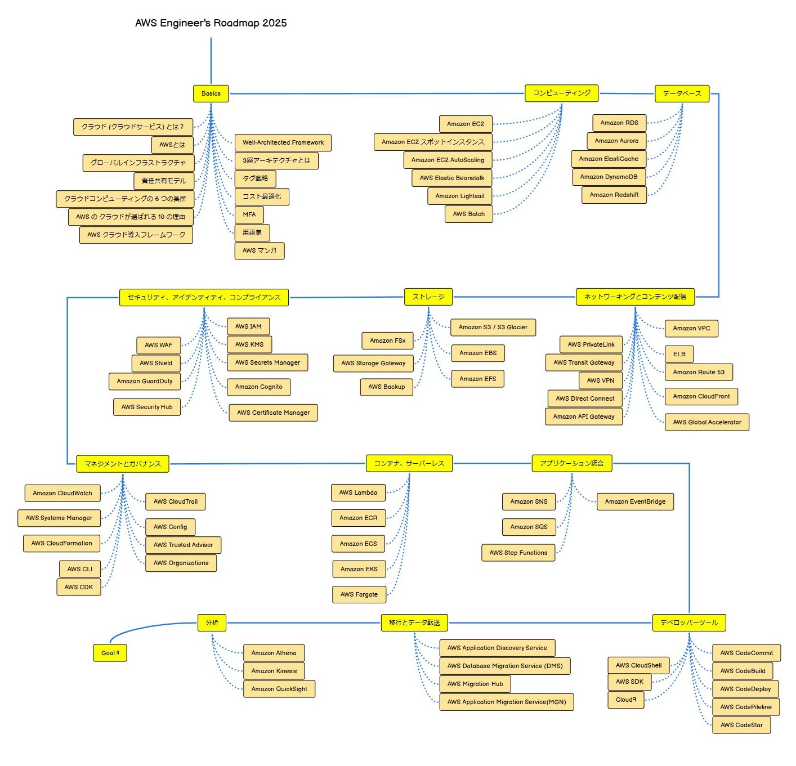

# aws-study

個人の AWS 勉強や、社内勉強会で使用した資料を公開しているリポジトリです。

AWS ドキュメントなどを参照し作成しておりますが、記載の誤り等が含まれる場合がございます。

最新の情報については、AWS 公式ドキュメントをご参照ください。

claat を使った Codelabs 形式ドキュメントは ⇒[GitHub Pages](https://ishiharatma.github.io/aws-study/)で公開しています。

[目次はこちら](./index.md)

## 学習ロードマップ

