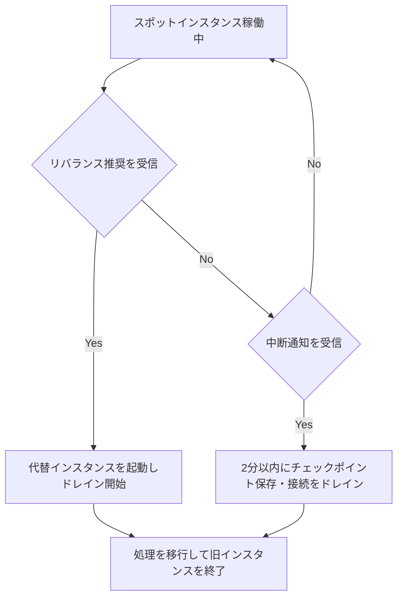
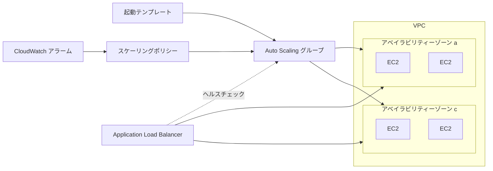
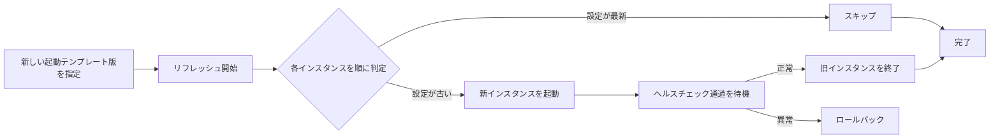
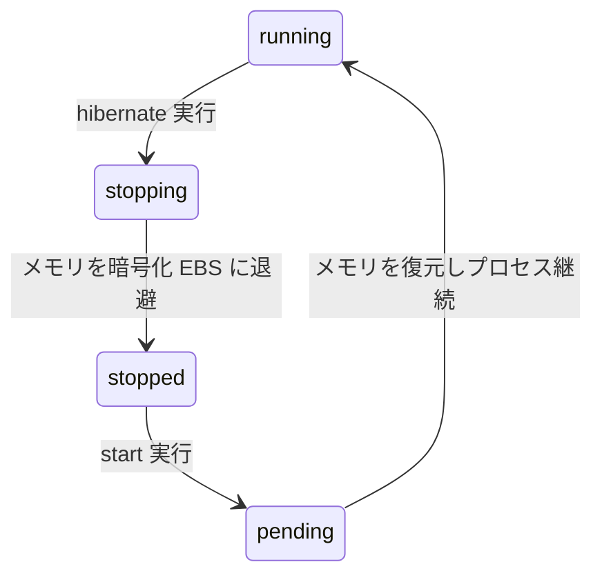
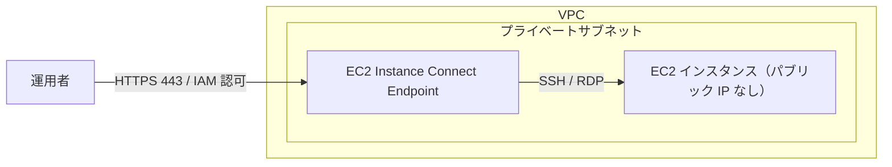

# Amazon EC2 応用ガイド <!-- omit in toc -->


## ☘️ はじめに<!-- omit in toc -->

本ページは、AWS に関する個人の勉強および勉強会で使用することを目的に、AWS ドキュメントなどを参照し作成しておりますが、記載の誤り等が含まれる場合がございます。

最新の情報については、AWS 公式ドキュメントをご参照ください。

本記事は基礎編の続編です。インスタンスタイプの命名規則、AMI、EBS ボリュームタイプ、IP アドレス、購入オプションの一覧、ライフサイクルといった基本事項は「Amazon EC2 入門」で解説しているため、本記事では重複を避け、応用的なトピックに絞っています。記載内容は 2026 年 8 月時点の情報です。

## 👀 Contents<!-- omit in toc -->

<!-- Duration: 00:00:30 -->

- [1. AWS Nitro System](#1-aws-nitro-system)
  - [1.1. Nitro System とは](#11-nitro-system-とは)
  - [1.2. 構成要素](#12-構成要素)
  - [1.3. ベアメタルインスタンス](#13-ベアメタルインスタンス)
  - [1.4. Nitro を前提とする機能](#14-nitro-を前提とする機能)
- [2. インスタンスタイプ Deep Dive](#2-インスタンスタイプ-deep-dive)
  - [2.1. 世代マップ（2026 年 8 月時点）](#21-世代マップ2026-年-8-月時点)
  - [2.2. バースト可能インスタンス（T 系）の内部動作](#22-バースト可能インスタンスt-系の内部動作)
  - [2.3. ベアメタルと専有オプション](#23-ベアメタルと専有オプション)
  - [2.4. インスタンスタイプの変更](#24-インスタンスタイプの変更)
- [3. キャパシティの確保と購入オプション](#3-キャパシティの確保と購入オプション)
  - [3.1. On-Demand Capacity Reservations](#31-on-demand-capacity-reservations)
  - [3.2. Capacity Blocks for ML](#32-capacity-blocks-for-ml)
  - [3.3. スポットインスタンスの実運用設計](#33-スポットインスタンスの実運用設計)
  - [3.4. EC2 Fleet と属性ベースのインスタンスタイプ選択](#34-ec2-fleet-と属性ベースのインスタンスタイプ選択)
  - [3.5. Dedicated Hosts](#35-dedicated-hosts)
- [4. EC2 Auto Scaling](#4-ec2-auto-scaling)
  - [4.1. 構成要素](#41-構成要素)
  - [4.2. スケーリングポリシー](#42-スケーリングポリシー)
  - [4.3. 予測スケーリング](#43-予測スケーリング)
  - [4.4. 混在インスタンスポリシー](#44-混在インスタンスポリシー)
  - [4.5. ウォームプール](#45-ウォームプール)
  - [4.6. インスタンスのリフレッシュ](#46-インスタンスのリフレッシュ)
  - [4.7. ライフサイクルフックとキャパシティリバランシング](#47-ライフサイクルフックとキャパシティリバランシング)
- [5. ネットワーキング](#5-ネットワーキング)
  - [5.1. Enhanced Networking と ENA Express](#51-enhanced-networking-と-ena-express)
  - [5.2. Elastic Fabric Adapter（EFA）](#52-elastic-fabric-adapterefa)
  - [5.3. インスタンス帯域幅の考え方](#53-インスタンス帯域幅の考え方)
  - [5.4. 複数 ENI とセカンダリ IP](#54-複数-eni-とセカンダリ-ip)
  - [5.5. プレイスメントグループ](#55-プレイスメントグループ)
- [6. イメージ管理とガバナンス](#6-イメージ管理とガバナンス)
  - [6.1. EC2 Image Builder](#61-ec2-image-builder)
  - [6.2. AMI のガバナンス](#62-ami-のガバナンス)
  - [6.3. Windows Fast Launch](#63-windows-fast-launch)
- [7. 運用とライフサイクル](#7-運用とライフサイクル)
  - [7.1. Hibernation（休止状態）](#71-hibernation休止状態)
  - [7.2. 自動復旧](#72-自動復旧)
  - [7.3. スケジュールされたイベントとメンテナンス](#73-スケジュールされたイベントとメンテナンス)
  - [7.4. インスタンスの保護](#74-インスタンスの保護)
  - [7.5. 接続方式の使い分け](#75-接続方式の使い分け)
  - [7.6. サイジングと Compute Optimizer](#76-サイジングと-compute-optimizer)
- [8. セキュリティ](#8-セキュリティ)
  - [8.1. IMDSv2](#81-imdsv2)
  - [8.2. Nitro Enclaves](#82-nitro-enclaves)
  - [8.3. UEFI セキュアブートと NitroTPM](#83-uefi-セキュアブートと-nitrotpm)
  - [8.4. キーペアと認証情報](#84-キーペアと認証情報)
  - [8.5. データ保護](#85-データ保護)
- [📖 まとめ](#-まとめ)
  - [参考リソース](#参考リソース)

## 1. AWS Nitro System

<!-- Duration: 00:05:00 -->

### 1.1. Nitro System とは

AWS Nitro System（ナイトロシステム）は、現行世代の EC2 インスタンスの基盤となっているハードウェアとソフトウェアの専用基盤です。仮想化のパフォーマンスとセキュリティを飛躍的に高めています。2012 年から開発が始まり、2017 年に発表されました。

従来の仮想化ではハイパーバイザーがホストの CPU やメモリを消費し、ネットワークやストレージの I/O もソフトウェアで処理していました。（雑に表現すると、パソコンにグラフィックボードを増設したイメージ）


Nitro System では、これらの処理を専用のハードウェア（Nitro カード）にオフロードし、ハイパーバイザーを最小限まで軽量化しています。


その結果、ホストサーバーのリソースをほぼすべて、利用者のインスタンスに割り当てられるようになり、ベアメタルに近いパフォーマンスと、一貫した I/O 性能が得られます。

- AWS ドキュメント > [AWS Nitro System](https://docs.aws.amazon.com/ja_jp/ec2/latest/instancetypes/ec2-nitro-instances.html)
- Whitepaper > [The Security Design of the AWS Nitro System](https://docs.aws.amazon.com/whitepapers/latest/security-design-of-aws-nitro-system/security-design-of-aws-nitro-system.html)
- Whitepaper > [The components of the Nitro System](https://docs.aws.amazon.com/whitepapers/latest/security-design-of-aws-nitro-system/the-components-of-the-nitro-system.html)

### 1.2. 構成要素

Nitro System は大きく 3 つの要素で構成されます。

| 要素 | 役割 |
| --- | --- |
| Nitro カード | VPC ネットワーク、Amazon EBS、インスタンスストレージ、システム管理・モニタリングを専用ハードウェアで処理する |
| Nitro セキュリティチップ | ハードウェアレベルの Root of Trust。ファームウェアの検証を行い、ホストへの管理アクセスを排除する |
| Nitro ハイパーバイザー | メモリと CPU の割り当てだけを担う軽量なハイパーバイザー。通常時はほとんどリソースを消費しない |

Nitro セキュリティチップにより、AWS の従業員であってもインスタンスへの対話的なアクセス（SSH 等）ができない設計になっています。

### 1.3. ベアメタルインスタンス

Nitro ハイパーバイザーは CPU とメモリの割り当てだけを担う薄い層ですが、その層すら介さない構成がベアメタルインスタンスです。Nitro System の延長線上にあるため、ここで併せて扱います（調達・ライセンス面は [2.3](#23-ベアメタルと専有オプション) を参照）。

インスタンスタイプ名の末尾が `.metal` のものはベアメタルインスタンスで、ハイパーバイザーを介さずに物理サーバーへ直接アクセスします。

- ハードウェアの仮想化支援機能（VT-x など）を必要とするワークロードや、独自ハイパーバイザーの実行に使える
- ライセンス上、物理コアやソケットの情報が必要なソフトウェアに対応できる
- EBS、ENA、セキュリティグループなど Nitro ベースの機能はベアメタルでも利用できる

### 1.4. Nitro を前提とする機能

本記事で扱う次の機能は、いずれも Nitro System 上でのみ利用できます。Enhanced Networking（ENA / EFA）、EBS 最適化のデフォルト有効化、インスタンスストアの自動暗号化、Hibernation、Nitro Enclaves、NitroTPM、UEFI セキュアブートが該当します。2026 年 6 月に一般提供された AWS Graviton5 搭載の M9g / M9gd インスタンスは、第 6 世代の Nitro System 上で動作しています。

## 2. インスタンスタイプ Deep Dive

<!-- Duration: 00:05:00 -->

### 2.1. 世代マップ（2026 年 8 月時点）

基礎編では命名規則を説明しました。ここでは、プロセッサ系統ごとの最新世代を整理します。世代が新しいほど価格性能比が高く、旧世代より単価が安く設定されることもあるため、新規構築では最新世代を第一候補にします。

| 系統 | 最新世代の例 | 補足 |
| --- | --- | --- |
| AWS Graviton（Arm） | Graviton4: `C8g` / `M8g` / `R8g` / `X8g`、Graviton5: `M9g` / `M9gd` | M9g / M9gd は 2026 年 6 月に一般提供開始。`C9g` / `R9g` は提供予定 |
| Intel | `M7i` / `M7i-flex`、`C8in` / `C8ib`、`X8i` | `C8in` / `C8ib` は 2026 年 4 月に一般提供開始。ネットワーク最大 600 Gbps |
| AMD | `M7a` / `C7a` / `R7a` | 高い定格クロックを求めるワークロード向け |
| GPU / アクセラレーテッド | `P6-B200` / `P6e-GB200`、`G7`、`Trn2`、`Inf2` | `P6-B200`（NVIDIA Blackwell）は 2026 年 5 月、`G7`（NVIDIA RTX PRO Blackwell）は 2026 年 6 月に提供開始 |
| HPC | `Hpc7g` / `Hpc7a` | クラスタープレイスメントグループと EFA を併用する |
| ハイメモリ | `U7i` 系、`X8g` | SAP HANA など大規模インメモリ DB 向け。`U7i` はメモリ最大 32 TiB 級 |

最新の対応リージョンやスペックは、インスタンスタイプ別のページで確認します。

AWS ドキュメント > [Amazon EC2 インスタンスタイプ](https://aws.amazon.com/jp/ec2/instance-types/)

### 2.2. バースト可能インスタンス（T 系）の内部動作

T 系インスタンス（`T3` / `T3a` / `T4g` など）は CPU クレジットという仕組みで動作します。基本的な考え方は次のとおりです。

- 1 CPU クレジットは、1 個の vCPU を 100 % で 1 分間動かす処理量に相当する
- インスタンスサイズごとに「ベースライン使用率」が決まっており、その使用率を下回っている間はクレジットが貯まる
- ベースラインを超えて CPU を使うとクレジットを消費し、クレジットが尽きるとベースラインまで性能が制限される

クレジットが不足したときの挙動は、モードによって変わります。

| モード | 挙動 | 備考 |
| --- | --- | --- |
| standard | クレジットが尽きるとベースライン性能に制限される | 追加課金は発生しない |
| unlimited | クレジット不足時も高性能を維持し、超過分を課金する | `T3` / `T3a` / `T4g` の起動時デフォルト |

EC2起動時にモードを変更できます。


継続的に CPU 使用率が高いワークロードでは、unlimited モードの超過課金がオンデマンドの M 系より割高になることがあります。CloudWatch の `CPUCreditBalance` や `CPUSurplusCreditBalance` を監視し、恒常的にクレジットが枯渇している場合は M 系や C 系への変更を検討します。

AWS ドキュメント > [バースト可能パフォーマンスインスタンス](https://docs.aws.amazon.com/ja_jp/AWSEC2/latest/UserGuide/burstable-performance-instances.html)

### 2.3. ベアメタルと専有オプション

macOS のビルドや CI に使う EC2 Mac インスタンス（`mac2`（Apple M2）、`mac2-m2pro` など）は、Dedicated Host 上のベアメタルインスタンスとしてのみ起動できます。Apple のライセンス条項に合わせて、Dedicated Host には最低 24 時間の割り当て課金が発生し、1 ホストにつき 1 インスタンスを起動します。

### 2.4. インスタンスタイプの変更

稼働中のインスタンスは、いったん停止してからタイプを変更し、再度起動することでスペックを変えられます。変更時は次の点に注意します。

- 変更後のタイプが、現在の AMI の仮想化方式やドライバ（ENA、NVMe）に対応している必要がある
- x86 と Arm（Graviton）の間でタイプを変更する場合は、アーキテクチャに対応した AMI を別途用意する
- インスタンスストアを使っている場合、停止した時点でデータは失われる

## 3. キャパシティの確保と購入オプション

<!-- Duration: 00:05:00 -->

基礎編ではオンデマンド、リザーブドインスタンス、Savings Plans、スポット、Dedicated Hosts の一覧を紹介しました。ここでは、キャパシティを能動的に確保する仕組みと、スポットを本番で使うための設計を扱います。

### 3.1. On-Demand Capacity Reservations

特定のアベイラビリティーゾーンで、指定したインスタンスタイプの容量をあらかじめ押さえておく仕組みが On-Demand Capacity Reservations（ODCR）です。予約している間は、インスタンスを起動していなくてもオンデマンド料金が発生します。Savings Plans やリージョン別リザーブドインスタンスの割引を、ODCR 上のインスタンスに適用することもできます。

| 種類 | 動作 |
| --- | --- |
| open | 予約条件（タイプ・AZ・プラットフォーム）に一致するインスタンスが自動的に予約枠を使う |
| targeted | 予約を明示的に指定して起動したインスタンスだけが予約枠を使う |

複数の予約をまとめて扱う Capacity Reservation group や、需要に応じて予約数を維持する Capacity Reservation Fleet も利用できます。

AWS ドキュメント > [オンデマンドキャパシティ予約](https://docs.aws.amazon.com/ja_jp/AWSEC2/latest/UserGuide/capacity-reservation-overview.html)

### 3.2. Capacity Blocks for ML

機械学習の学習ジョブのように、短期間だけ大量の GPU をまとめて確保したいことがあります。これに応えるのが Capacity Blocks for ML で、GPU などのアクセラレーテッドインスタンスを将来の特定期間だけ予約します。

- 1 〜 64 インスタンスのクラスター単位で予約する
- 最長で約 6 か月、最大 8 週間先まで予約できる
- 予約されたインスタンスは低レイテンシのクラスター配置となり、EFA を利用できる

Capacity Blocks for ML と中断可能なキャパシティ予約は、Capacity Reservation Resource Group にまとめて管理できます。

AWS ドキュメント > [Capacity Blocks for ML](https://docs.aws.amazon.com/ja_jp/AWSEC2/latest/UserGuide/ec2-capacity-blocks.html)

### 3.3. スポットインスタンスの実運用設計

スポットインスタンスは中断を前提に設計すれば大幅なコスト削減につながります。安定して使うための要点は配分戦略と中断ハンドリングです。

| 配分戦略 | 内容 |
| --- | --- |
| price-capacity-optimized | 中断されにくく、かつ価格が低いプールから起動する。多くのワークロードで推奨 |
| capacity-optimized | 中断されにくさを最優先する |
| lowest-price | 価格を最優先する。中断が増えやすい |

中断は 2 分前に通知されます。加えて、より早いタイミングで「リバランス推奨（Rebalance Recommendation）」が発行されることがあり、これを検知して新しいインスタンスへ処理を移すことで、中断の影響を抑えられます。



設計上の推奨は、10 種類以上のインスタンスタイプと全 AZ に分散すること、処理をステートレスに保つかチェックポイントを取ること、Auto Scaling や EC2 Fleet の Capacity Rebalancing を有効にすることです。特定タイプへの依存度は、事前に Spot Placement Score で確認できます。

AWS ドキュメント > [スポットインスタンスのベストプラクティス](https://docs.aws.amazon.com/ja_jp/AWSEC2/latest/UserGuide/spot-best-practices.html)

### 3.4. EC2 Fleet と属性ベースのインスタンスタイプ選択

EC2 Fleet と Spot Fleet は、オンデマンドとスポットを組み合わせて、1 回の API 呼び出しで複数のインスタンスタイプ・AZ にまたがる容量を確保する仕組みです。

属性ベースのインスタンスタイプ選択（Attribute-Based Instance Type Selection）を使うと、インスタンスタイプを列挙する代わりに、必要な vCPU 数、メモリ量、プロセッサ世代、アクセラレータの有無といった属性を指定できます。条件に合うタイプを AWS が選ぶため、新しいタイプが登場すると自動的に候補に加わります。指定属性から外れた高額なタイプを誤って使わないよう、価格保護の仕組みも用意されています。

### 3.5. Dedicated Hosts

Dedicated Hosts は物理サーバーを丸ごと専有するオプションで、Dedicated Instances とは目的が異なります。

| 項目 | Dedicated Instances | Dedicated Hosts |
| --- | --- | --- |
| 分離の単位 | アカウント単位でハードウェアを分離 | 物理サーバーを指定して専有 |
| ソケット・コアの可視性 | なし | あり（コア単位・ソケット単位の BYOL に対応） |
| 用途 | ハードウェア分離の要件を満たす | 持ち込みライセンスの管理、ホスト配置の制御 |

Dedicated Hosts は AWS License Manager と連携し、ライセンスの消費状況を追跡できます。ホストをまとめて管理する Host Resource Group や、ホスト障害時に別ホストへ復旧する Host Recovery も利用できます。

## 4. EC2 Auto Scaling

<!-- Duration: 00:05:00 -->

EC2 Auto Scaling は、負荷や障害に応じてインスタンス数を自動で増減させ、必要な台数を維持するサービスです。基礎編で触れた Auto Recovery が単一インスタンスの復旧であるのに対し、こちらはグループ全体の台数を管理します。

AWS ドキュメント > [Amazon EC2 Auto Scaling とは](https://docs.aws.amazon.com/ja_jp/autoscaling/ec2/userguide/what-is-amazon-ec2-auto-scaling.html)

### 4.1. 構成要素

Auto Scaling グループ（ASG）は、最小・希望・最大の台数と、対象の AZ を指定して作成します。ヘルスチェックには EC2 のステータスチェック、ELB のヘルスチェック、カスタムヘルスチェックがあり、異常と判断されたインスタンスは自動的に置き換えられます。

インスタンスの起動設定には起動テンプレートを使います。旧来の起動設定（Launch Configuration）は新規に作成できなくなっており、最新のインスタンス機能にも対応しないため、既存のものは起動テンプレートへ移行します。



### 4.2. スケーリングポリシー

| ポリシー | 動作 | 主な用途 |
| --- | --- | --- |
| ターゲット追跡 | 指標（CPU 使用率やリクエスト数）を目標値に保つよう台数を調整 | 一般的な Web アプリケーション |
| ステップスケーリング | 指標の乖離幅に応じて増減する台数を段階的に指定 | 急峻な負荷変動 |
| シンプルスケーリング | 1 つのアラームで一定台数を増減 | シンプルな構成（現在はターゲット追跡が推奨） |
| スケジュールスケーリング | 日時を指定して台数を変更 | 営業時間やバッチ処理の時間帯が決まっている場合 |

### 4.3. 予測スケーリング

[予測スケーリング](https://docs.aws.amazon.com/ja_jp/autoscaling/ec2/userguide/ec2-auto-scaling-predictive-scaling.html)は、過去の負荷履歴を機械学習で分析し、将来の需要を予測して事前にインスタンスを増やすポリシーです。最大 48 時間先までを予測し、1 時間ごとに更新します。曜日や時間帯で周期的に負荷が変動するワークロードで、立ち上がりの遅延を避けたい場合に有効です。実際のスケーリングを行わず予測値だけを生成する「予測のみ」モードで、事前に精度を確認できます。

### 4.4. 混在インスタンスポリシー

[混在インスタンスポリシー（Mixed Instances Policy）](https://docs.aws.amazon.com/autoscaling/ec2/APIReference/API_MixedInstancesPolicy.html)を使うと、1 つの ASG でオンデマンドとスポットを組み合わせ、複数のインスタンスタイプから起動できます。ベースとなる台数をオンデマンドで確保し、それを超える分をスポットでまかなう、といった構成が可能です。ここでも属性ベースのインスタンスタイプ選択を指定でき、スポットの分散要件を満たしやすくなります。

### 4.5. ウォームプール

起動に数分かかるアプリケーションでは、スケールアウトのたびに AMI の展開や初期化を待つ時間が無視できません。[ウォームプール](https://docs.aws.amazon.com/ja_jp/autoscaling/ec2/userguide/ec2-auto-scaling-warm-pools.html)は、初期化を済ませたインスタンスを停止状態（または Running、Hibernate 状態）で待機させておき、スケールアウト時にそこから引き出す仕組みです。混在インスタンスポリシーを持つ ASG でも利用できます。

### 4.6. インスタンスのリフレッシュ

インスタンスのリフレッシュ（Instance Refresh）は、ASG 内のインスタンスをローリング方式で置き換え、新しい起動テンプレートや AMI を反映する機能です。

- スキップマッチングにより、すでに最新設定のインスタンスは置き換えをスキップする
- 「最小正常率」「最大正常率」で、更新中に維持する稼働台数を制御する
- チェックポイントを設定して段階的に進められる
- 異常を検知した場合は自動でロールバックできる

インスタンスのリフレッシュは AWS CloudFormation からも定義でき、デプロイ手順に組み込めます。



### 4.7. ライフサイクルフックとキャパシティリバランシング

インスタンスの起動直後にデータをロードしたい、終了前にログを退避したい。こうした処理を待機状態で挟み込むのが[ライフサイクルフック](https://docs.aws.amazon.com/ja_jp/autoscaling/ec2/userguide/lifecycle-hooks.html)です。

[キャパシティリバランシング](https://docs.aws.amazon.com/ja_jp/autoscaling/ec2/userguide/ec2-auto-scaling-capacity-rebalancing.html)を有効にすると、スポットのリバランス推奨を受けた時点で ASG が先回りして代替インスタンスを起動します。


## 5. ネットワーキング

<!-- Duration: 00:05:00 -->

基礎編では ENI と IP アドレスの基本を扱いました。ここでは高性能ネットワークと帯域幅の考え方を扱います。

### 5.1. Enhanced Networking と ENA Express

Enhanced Networking は、SR-IOV により仮想化のオーバーヘッドを抑え、高いスループットと低いレイテンシ、少ない CPU 使用率を実現する仕組みです。現行世代では Elastic Network Adapter（ENA）を使い、インスタンスタイプによって最大 100 〜 200 Gbps（一部の高性能タイプでは 400 Gbps 以上）のネットワーク帯域に対応します。

ENA Express は、AWS の Scalable Reliable Datagram（SRD）プロトコルを使って、単一フローの帯域とテールレイテンシを改善する機能です。単一フローの上限が 5 Gbps から 25 Gbps に広がり、混雑時の P99.9 レイテンシが大きく改善します。同一リージョン内であれば、AZ をまたぐ通信でも ENA Express を利用できます。

### 5.2. Elastic Fabric Adapter（EFA）

EFA は、HPC や分散機械学習向けのネットワークインターフェースです。OS カーネルをバイパスして通信することで、MPI や NCCL を使ったノード間通信のレイテンシを下げ、スケールアウト時の効率を高めます。クラスタープレイスメントグループと組み合わせて使います。現在は ENA から分離した EFA 専用インターフェースも選べ、アクセラレータ間の通信に帯域を専有できます。

### 5.3. インスタンス帯域幅の考え方

インスタンスの「ネットワーク帯域幅」には、常時利用できるベースラインと、一時的に到達できるバースト上限があります。スペック表で「最大 12.5 Gbps」のように書かれている値はバースト上限で、継続的に出せる帯域ではない点に注意します。

- 単一フロー（5 タプルが同一の通信）には上限があり、同一 AZ 内では 5 Gbps、ENA Express 利用時は 25 Gbps が目安
- インターネットゲートウェイ経由や他リージョンへの通信では、インスタンス帯域の一定割合が上限になる
  - インターネットゲートウェイを通過する利用可能な帯域幅の 50%
- 高い集約帯域が必要な場合は、通信を複数フローに分散する

### 5.4. 複数 ENI とセカンダリ IP

1 つのインスタンスに複数の ENI をアタッチでき、アタッチできる ENI 数と ENI あたりの IP 数はインスタンスタイプで決まります。コンテナを高密度に配置する場合は、IP を 1 つずつ払い出す代わりに、[プレフィックス委任](https://docs.aws.amazon.com/ja_jp/AWSEC2/latest/UserGuide/ec2-prefix-eni.html)で ENI に IPv4 の `/28` や IPv6 の `/80` をまとめて割り当てられます。IPv6 のみのサブネットに対応したインスタンスタイプもあります。


### 5.5. プレイスメントグループ

基礎編で 3 種類の配置戦略を紹介しました。運用時に関わる制限は次のとおりです。

| 種類 | 主な制限 |
| --- | --- |
| クラスター | 単一 AZ 内。EFA と組み合わせて HPC・分散学習に使う |
| パーティション | 1 AZ あたり最大 7 パーティション。分散データストア向け |
| スプレッド | 1 AZ あたり最大 7 インスタンス（ラックレベル）。重要インスタンスの分散に使う |

## 6. イメージ管理とガバナンス

<!-- Duration: 00:05:00 -->

### 6.1. EC2 Image Builder

EC2 Image Builder は、カスタム AMI やコンテナイメージの作成・テスト・配布を自動化するマネージドサービスです。基礎編で触れたゴールデン AMI を、手作業ではなくパイプラインで継続的に更新できます。


構築したイメージは AWS 提供のテストや独自テストで検証でき、CVE スキャンによる脆弱性チェックも行えます。ライフサイクルポリシーはワイルドカードに対応しており、複数のレシピのイメージを 1 つのポリシーでまとめて管理できます。

AWS ドキュメント > [EC2 Image Builder とは](https://docs.aws.amazon.com/ja_jp/imagebuilder/latest/userguide/what-is-image-builder.html)

### 6.2. AMI のガバナンス

意図しない AMI の利用や、誤操作による AMI の削除を防ぐ機能が拡充されています。

| 機能 | 内容 |
| --- | --- |
| Allowed AMIs | アカウントや組織単位で、起動に使える AMI を提供元・作成日・名前パターン・Marketplace コードなどの条件で制限する。2025 年 9 月に条件のパラメータが拡充された |
| 登録解除保護 | AMI を保護対象に指定すると、保護を明示的に解除するまで登録解除できない。24 時間のクールダウン期間も設定できる |
| スナップショットの自動削除 | AMI の登録解除時に、元になった EBS スナップショットもまとめて削除できる（2025 年 6 月） |
| 非推奨（Deprecation） | AMI に非推奨日を設定し、既定の検索結果から除外する |
| Recycle Bin | 削除した AMI やスナップショットを保持期間内は復元できる |
| パブリックアクセスのブロック | アカウント単位で AMI の一般公開を禁止する |

### 6.3. Windows Fast Launch

Windows Fast Launch は、Sysprep 後の状態を事前にスナップショットとして準備しておき、そこからインスタンスを起動する機能です。通常は初回起動時に実行される処理を省けるため、Windows インスタンスの起動時間を短縮できます。

## 7. 運用とライフサイクル

<!-- Duration: 00:05:00 -->

### 7.1. Hibernation（休止状態）

Hibernation は、インスタンスのメモリ内容を暗号化したルート EBS ボリュームに書き出して停止し、再開時にメモリを復元してプロセスを継続させる機能です。通常の停止と異なり、OS やアプリケーションの再起動が不要になります。



利用には次の前提があります。

- 起動時に Hibernation を有効化しておく（後から有効化できない）
- ルートボリュームが暗号化されている
- 対応するインスタンスタイプ・AMI で、RAM が 150 GiB 未満を目安とする
- 休止状態を維持できる期間には上限がある（60 日を目安）


AWS ドキュメント > [Amazon EC2 インスタンスの休止状態](https://docs.aws.amazon.com/ja_jp/AWSEC2/latest/UserGuide/Hibernate.html)

### 7.2. 自動復旧

現行世代のインスタンスでは、ハードウェア障害を検知すると、同じインスタンス ID のまま別のハードウェアで再起動する「簡易自動復旧」がデフォルトで有効です。プライベート IP、Elastic IP、メタデータは維持されます。より細かく制御したい場合は、[CloudWatch アラームの復旧アクション](https://docs.aws.amazon.com/ja_jp/AWSCloudFormation/latest/UserGuide/quickref-cloudwatch.html#cloudwatch-sample-recover-instance)を設定します。インスタンスストアを使っている場合など、自動復旧の対象外となる条件があります。


また、デフォルトで有効化されている「簡易自動復旧」と「CloudWatch アラーム復旧」が同時に設定されているときは、二重で実行されないようになっていますが、どちらが実行されるかは保証されないとのことです。

簡易自動復旧が行われた場合には、EventBridgeで検知できますので、以下のような設定をしておくとよいでしょう。

```json
{
  "source": ["aws.health"],
  "detail-type": ["AWS Health Event"],
  "detail": {
    "service": ["EC2"],
    "eventTypeCategory": ["accountNotification"],
    "eventTypeCode": ["AWS_EC2_SIMPLIFIED_AUTO_RECOVERY_FAILURE", "AWS_EC2_SIMPLIFIED_AUTO_RECOVERY_SUCCESS"]
  },
  "resources": ["i-xxxxxxxxxxxxxxxxx"]
}
```

AWS ドキュメント > [インスタンスの自動復旧](https://docs.aws.amazon.com/ja_jp/AWSEC2/latest/UserGuide/ec2-instance-recover.html)

### 7.3. スケジュールされたイベントとメンテナンス

AWS は、インスタンスの再起動や停止、退役（Retirement）、システムメンテナンスを事前にスケジュールし、通知します。通知は AWS Health や Amazon EventBridge から受け取れるため、これらを起点に事前対応を自動化できます。OS のパッチ適用は Systems Manager Patch Manager のメンテナンスウィンドウで管理します。

AWS ドキュメント > [Amazon EC2 インスタンスの予定されているイベント](https://docs.aws.amazon.com/ja_jp/AWSEC2/latest/UserGuide/monitoring-instances-status-check_sched.html)

### 7.4. インスタンスの保護

| 保護 | 内容 |
| --- | --- |
| 終了保護 | API やコンソールからの終了操作をブロックする |
| 停止保護 | 停止操作をブロックする。停止でデータが失われる構成の保護に使う |
| シャットダウン動作 | OS 内からのシャットダウン時に、停止と終了のどちらにするかを指定する |

本番インスタンスでは終了保護を有効にしておくと、誤操作による削除を防げます。


### 7.5. 接続方式の使い分け

基礎編ではキーペアと Session Manager に触れました。現在は用途に応じて次の方式を選べます。

| 方式 | 特徴 |
| --- | --- |
| SSH / RDP + キーペア | 従来の方式。ポート開放と鍵管理が必要。現在ではあまり推奨されない。他の方式を優先して選択する。 |
| EC2 Instance Connect | コンソールや CLI から一時鍵で接続。パブリックサブネット向け |
| EC2 Instance Connect Endpoint | プライベートサブネットのインスタンスへ、踏み台なしで SSH / RDP 接続する |
| Session Manager | エージェント経由でシェルを取得。ポート開放も鍵も不要 |
| Serial Console | ネットワーク不通時にシリアル接続でトラブルシュートする |

EC2 Instance Connect Endpoint は、VPC 内に配置したエンドポイント経由で接続を中継します。インバウンドのポート開放や踏み台サーバーが不要になり、接続は IAM で認可され、操作は CloudTrail に記録されます。

運用の入口を絞るなら、SSM エージェントを入れられる環境では Session Manager、SSH クライアントをそのまま使いたい場合は EC2 Instance Connect Endpoint を既定にすると、鍵とポート開放の管理から解放されます。



### 7.6. サイジングと Compute Optimizer

AWS Compute Optimizer は、CloudWatch のメトリクスを分析し、インスタンスが過剰または不足しているかを判定して、適切なタイプとサイズを推奨します。Graviton への移行候補も示されます。Cost Explorer の Savings Plans 推奨と合わせて、定期的にインスタンスの構成を見直します。

## 8. セキュリティ

<!-- Duration: 00:03:00 -->

### 8.1. IMDSv2

インスタンスメタデータサービスは、セッション指向のトークンを必要とする IMDSv2 の使用が推奨されています。リージョン単位で新規インスタンスの既定値を「IMDSv2 のみ」に設定でき、IMDSv1 での呼び出しが拒否された回数は CloudWatch の `MetadataNoTokenRejected` で確認できます。詳細は[個別記事](https://zenn.dev/issy/articles/zenn-ec2-imdsv2-only)で扱っています。

### 8.2. Nitro Enclaves

Nitro Enclaves は、EC2 インスタンスから CPU とメモリを切り出して作る、分離された実行環境です。親インスタンスとは vsock（ローカルソケット）でのみ通信でき、永続ストレージ、対話的アクセス、外部ネットワークを持ちません。親インスタンスの管理者（root）からも中身にアクセスできない設計です。

暗号による構成証明（アテステーション）と AWS KMS の連携により、「許可されたコードを実行しているエンクレーブだけが特定の鍵を使える」といった制御ができます。個人情報や鍵の処理など、機密性の高いデータを扱う用途に向いています。追加料金はなく、利用する EC2 インスタンスの料金だけがかかります。


AWS ドキュメント > [AWS Nitro Enclaves とは](https://docs.aws.amazon.com/ja_jp/enclaves/latest/user/nitro-enclave.html)

### 8.3. UEFI セキュアブートと NitroTPM

UEFI ブートモードのインスタンスでは、UEFI セキュアブートによりブートチェーンの各コンポーネントの署名を検証し、改ざんされたブートローダーやカーネルの実行を防げます。NitroTPM は仮想的な TPM 2.0 デバイスで、測定値の保存や、Windows の BitLocker のような TPM を前提とする機能に利用できます。

### 8.4. キーペアと認証情報

キーペアは RSA に加えて ed25519 を選べます。Session Manager や EC2 Instance Connect を使えば、恒久的な鍵を配置せずに接続できます。不要な場合はキーペアを作成しないようにしましょう。

AWS サービスへのアクセスには IAM ロールをインスタンスプロファイルとしてアタッチし、認証情報はメタデータ経由で自動的に取得・更新されます。この認証情報を保護するため、IMDSv2 の強制を併用します。

### 8.5. データ保護

アカウント単位で EBS のデフォルト暗号化を有効にすると、新規に作成するボリュームとスナップショットが常に暗号化されます。AMI は暗号化した状態でコピーでき、Nitro System 上ではインスタンスストア（ローカル NVMe）も自動的に暗号化されます。

## 📖 まとめ

- 新規構築は Nitro System 前提の最新世代から選ぶ。応用機能の多くが Nitro 上でのみ動く
- 定常的に CPU を使うワークロードに T 系は不向き。M 系・C 系を検討する
- キャパシティは、確実性重視なら ODCR / Capacity Blocks、コスト重視ならスポット
- Auto Scaling は起動テンプレート + ターゲット追跡が基本形
- ネットワークはバースト値とベースラインを分けて考える
- セキュリティは IMDSv2 の強制と EBS デフォルト暗号化を先に有効化しておく

### 参考リソース

- [Amazon EC2 ユーザーガイド](https://docs.aws.amazon.com/ja_jp/AWSEC2/latest/UserGuide/)
- [AWS Nitro System](https://docs.aws.amazon.com/ja_jp/AWSEC2/latest/UserGuide/ec2-nitro-instances.html)
- [Amazon EC2 Auto Scaling ユーザーガイド](https://docs.aws.amazon.com/ja_jp/autoscaling/ec2/userguide/)
- [Amazon EC2 インスタンスタイプ](https://aws.amazon.com/jp/ec2/instance-types/)
